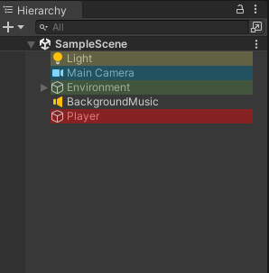
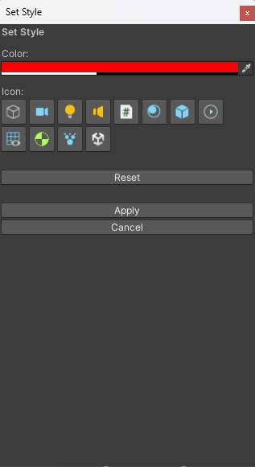
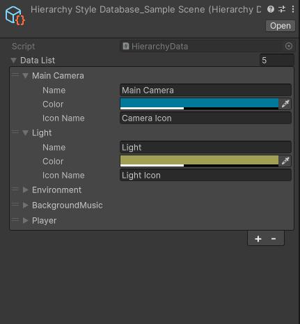

# **BetterHierarchy**
 
BetterHierarchy is a **prototype** for a Unity tool that allows the user to customise the hierarchy more. Features currently available are a customisable background colour and a default Unity icon for each game object.

## How to Use

To change the style of a game object, simply press Alt+Right on the game object and the Style Editor window will appear.

Alternatively, you can navigate to Assets→BetterHierarchy→Editor→Data→HierachyStyleDatabase_{sceneName} to manually change the style of the objects. As the saving system works with names, all objects with the same name will have the same style, so you can set up styles for game objects that do not yet exist.

